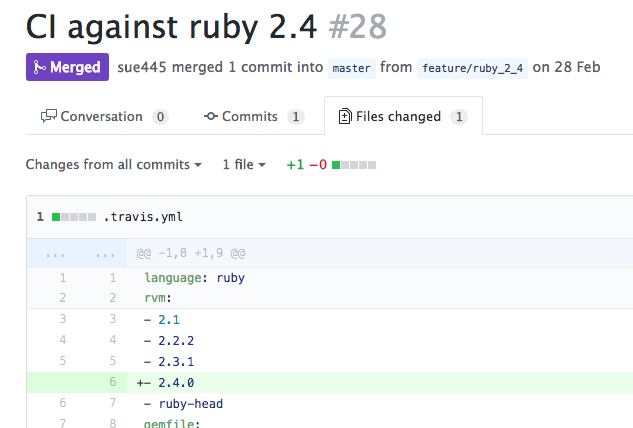
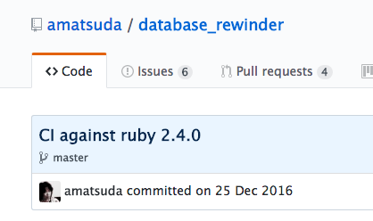
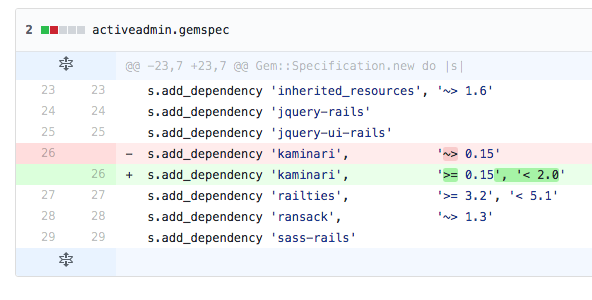
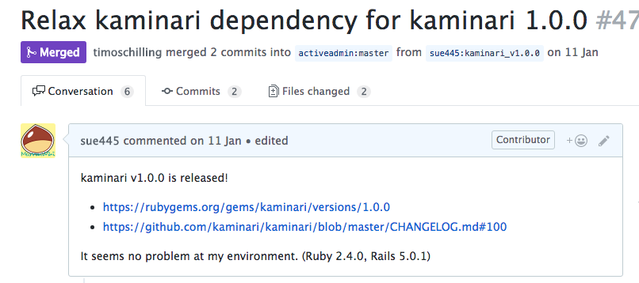
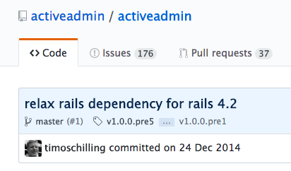
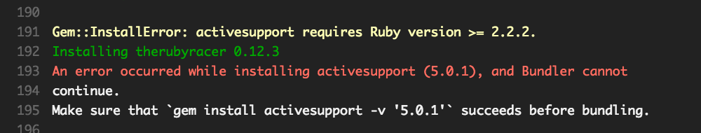
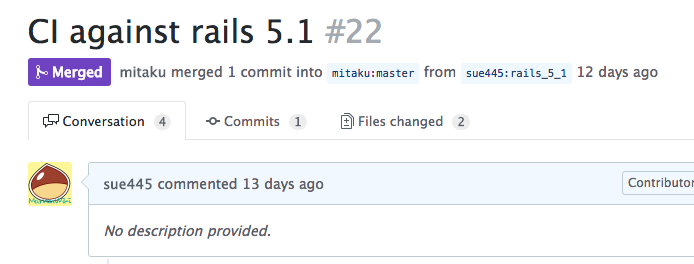
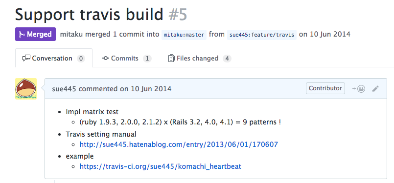

# 今日から使える！OSSプルリク集 #megurorb
sue445

2017/04/20 [Meguro.rb#2](https://megurorb.connpass.com/event/55107/)

---
## 自己紹介 [](https://twitter.com/sue445)
* Go Sueyoshi a.k.a [sue445](https://twitter.com/sue445)
* [株式会社ドリコム](http://www.drecom.co.jp/) 所属
  * インフラストラクチャー部
  * 社内gemを中心にアプリからインフラまでだいたいサーバサイドを浅く広く見てる
* 今まで作った主要なものは [sue445 Advent Calendar 2016 - Qiita](http://qiita.com/advent-calendar/2016/sue445) を参照
* 「ドリコムのプリキュアの人」として社内外で有名
* Twitterは上級者向けのアカウントなのでフォロー厳禁 :warning:

---
### 今期の嫁：キュアカスタード


---
### 本気の嫁：キュアピース


---
## 今日話すこと
* OSSにプルリク出す時のあるあるネタを実用例を交えて紹介

---
## 1. ドキュメントのtypoなどを修正
* これが一番プルリクの難易度は低い

---
### https://github.com/gitlabhq/gitlabhq/pull/7534
* GitLabのwebhookで実装はされているが、リファレンスから漏れているパラメータがいくつかあったので追加
* 「◯◯（プルリク番号）で追加されているけどその時にリファレンスに更新されていないよ！」って言えればベスト
* GitLabはAPIの実装とリファレンスの差異が結構多いので狙い目
  * 今は GitHub ではなく https://gitlab.com/gitlab-org/gitlab-ce だけでissueなどを受け付けている

---
## 2. .travis.yml に新しいRubyのバージョンを追加
```yml
rvm:
  - 2.1
  - 2.2.2
  - 2.3.1
  # ここに2.4を追加したい
```

---
### CI against ruby 2.4
https://github.com/sue445/index_shotgun/pull/28/files



---
### 英文の元ネタ
https://github.com/amatsuda/database_rewinder/commit/6a1f87c3a0729391bd24c68f38d28622d385479b



「CI against 〜」は使いやすいので定型句として覚えていていい

---
## 3. gemの新しいバージョンが出たので依存を緩めたい


---
## https://github.com/activeadmin/activeadmin/pull/4722
* kaminari v1系が出た直後に、activeadminでkaminari 1系使うために依存を緩めたかった



---
### 英文の元ネタ
https://github.com/activeadmin/activeadmin/commit/7a861b723bd65ea174541cf2f23048143575cba8



「Relax ◯◯ dependency for △△△」も使いやすいので定型句として覚えていていい

---
## 4. activesupportやactiverecordに依存してるgemでRuby 2.2未満系でコケるので5系未満使うようにする
* 1年以上ビルドしてないようなリポジトリだと久しぶりのPRでビルドがコケる原因第1位



https://travis-ci.org/railsware/global/jobs/198722120

---
### Gemfileにとりあえずこれ書いとけば `bundle install` できるのでPR送る
```ruby
if Gem::Version.create(RUBY_VERSION) < Gem::Version.create("2.2.2")
  # activesupport 5+ requires MRI 2.2.2+
  gem "activesupport", "< 5.0.0"
end
```

* 「Ruby 2.2.2未満で動かんからとりあえずサポート切ったわ！」っていきなりPR送るのは穏やかじゃないので、Ruby 2.2.2未満だったらCIでactivesupport 5系使わないようにしてCIを正常な状態に戻すのが平和
* 実際にRuby 2.2.2未満のサポート切るかどうかはリポジトリオーナーの判断に委ねる

---
### Tips：バージョンは文字列比較ではなく [Gem::Version](https://docs.ruby-lang.org/ja/2.4.0/class/Gem=3a=3aVersion.html) で比較した方がいい

```ruby
"2.1.10" > "2.1.2"
#=> false

Gem::Version.create("2.1.10") > Gem::Version.create("2.1.2")
#=> true

"5.1.0" > "5.1.0.rc1"
#=> false

Gem::Version.create("5.1.0") > Gem::Version.create("5.1.0.rc1")
#=> true
```

---
## 5. Railsのrc出たからとりあえずビルドしようぜー！
https://github.com/mitaku/komachi_heartbeat/pull/22



---
### .travis.ymlで複数gemfile対応してるのであればgemfile作って1行追加するだけ
gemfiles/rails5_1.gemfile

```ruby
source "https://rubygems.org"

gem 'rails', "~> 5.1.0.rc1"

gemspec path: '../'
```

.travis.yml

```yaml
gemfile:
  - gemfiles/rails4_1.gemfile
  - gemfiles/rails4_2.gemfile
  - gemfiles/rails5_0.gemfile
  - gemfiles/rails5_1.gemfile # <- 1行追加
```

---
### 正式版じゃないのでallow_failuresにしておいて、ビルドコケるのは許容する
```yaml
matrix:
  allow_failures:
    # NOTE: There are unstable versions
    - rvm: ruby-head
    - gemfile: gemfiles/rails5_1.gemfile # TODO: Remove this after rails5.1 is released!
```

---
## 6. Travis CI対応してないリポジトリに .travis.yml 投げつける
* 自分のforkしたリポジトリでTravis CI設定してちゃんと動作確認した後でPR送るのが親切
* https://github.com/mitaku/komachi_heartbeat/pull/5




---
## Let's contribute! :innocent:
